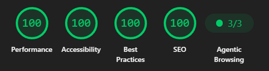

# Local Weather Dashboard

The deployment of this site is to be found live here:
https://frederickbetterdev.vercel.app/ 

Take-home assessment for Better Developers: a dashboard showing current weather and a 7-day
forecast for Aarhus, Denmark, built with Vite + React and styled with Shadcn/Tailwind. Weather
data comes from the [Open-Meteo](https://open-meteo.com/) API (no API key required), fetched via
a small `useState`/`useEffect` hook — a single non-paginated request for one fixed location
doesn't need a caching/dedup library, so loading/error state is handled directly rather than
pulled in from one.

If the live fetch fails, the dashboard falls back to static sample data (`src/api/mockWeatherData.ts`)
instead of a blank error screen, with a banner indicating that offline mock data is being shown, along with a retry button. This fallback banner *is* the app's error state.  An explanation to this can be found in the trade offs section.

**Hours spent:** 18
*A detailed day-by-day devlog and hours spent per day can be read in [DEVLOG.md](./DEVLOG.md).*

## Running locally

```bash
npm install
npm run dev
```

Other scripts:

```bash
npm run build    # type-check and produce a production build
npm run preview  # preview the production build locally
npm run lint      # run ESLint
npm test         # run the unit test suite (Vitest)
npx vitest run --coverage # to see code coverage. will prompt a package install.
```

No environment variables or API keys are required, as Open-Meteo's forecast endpoint is public.

## Project structure

- **`src/api/`**: Fetching (`openMeteo.ts`) and pure mapping (`weatherMapper.ts`) are kept
  separate so the WMO-code/response-shaping logic is unit-testable without mocking the network.
  `mockWeatherData.ts` is the static fixture used by the offline fallback.
- **`src/hooks/`**: `useWeather`, the single hook composing the API layer for components to
  consume (loading/fallback state, refetch).
- **`src/components/dashboard/`**: The five composed dashboard sections (hero, hourly strip,
  air conditions, weekly forecast, LLM-insight slot) plus `conditionMeta.ts`, the single source
  of truth mapping a `WeatherCondition` to its icon/label/accent color.
- **`src/components/state/`**: What renders instead of the dashboard: loading skeleton, empty
  state, and the fallback banner shown when live data isn't available.
- **`src/components/ui/`**: Shadcn-generated primitives (Button, Card, Alert, Skeleton).
- **`src/lib/`**: Small, pure helpers: date formatting (`date.ts`), theme resolution
  (`theme.ts`), shared constants, Shadcn's `cn` utility.
- **`localweatherdashboard/src/components/ThemeToggle.tsx`:** Contains the state machine logic for switching between themes.

Every module above with important-to-test logic has a co-located `*.test.ts(x)` file — see Testing
below for what's covered and why.

## Testing

Unit tests use [Vitest](https://vitest.dev/) + [Testing Library](https://testing-library.com/).
17 test files across the data layer, dashboard components, and app states:

- **`src/api/weatherMapper.ts`**: The pure mapping logic (WMO weather-code mapping app-level condition, and the Open-Meteo response to `WeatherData` shape), since that's where a silent bug would show the wrong weather to a user without any type error to catch it. Not good!
- **`src/api/openMeteo.ts`**: The fetch layer's error handling, via a mocked `fetch`: the non-`ok` response path, malformed/non-JSON response bodies, and the request timeout.
- **`src/hooks/useWeather.ts`**: The hook itself, via `renderHook` and a mocked `fetch`: the loading to success transition, the loading to mock-data-fallback transition on failure, and that `refetch()` re-runs the fetch.
- **`src/lib/date.ts`**: The local-date/weekday/hour formatting helpers, including the UTC-boundary regression guards called out in their own doc comments.
- **`src/lib/theme.ts`**: The pure mode-switching function.
- **Dashboard components** (`src/components/dashboard/`): `conditionMeta` looks up the icon and label for each WeatherCondition, `WeatherHero` renders temperature and conditions, `WeatherInsight` renders nothing when `insight` is `null`, but renders the text when present, `TodayForecastStrip`,
  `AirConditions`, `WeeklyForecast` + `ForecastDayRow` contains respective data, and `WeatherDashboard` is a "shell" for the respective UI state components.
- **App states** (`src/components/state/`): `LoadingState`, `ErrorState` (unused since the fallback banner overwrites, but kept for reference), `EmptyState`, `FallbackBanner` including the retry fallback.

```bash
npm test # Run tests
```

### Lighthouse scoring

Running the preview build through Lighthouse in Google's DevTools shows us scores of 100 across all metrics:


The lighthouse metrics measure something different from the unit tests. Lighthouse checks runtime output (contrast, semantic markup, load performance and even SEO despite it not being that important here) rather than logic correctness. It's independent, automated evidence that the app meets current web standards though, and not just a subjective 'it looks fine to me.'

Please note that running a lighthouse analysis on the production deployment *could* show a slightly different score.


## Assumptions & trade-offs
### Assumptions

- **Web app, not native.** Nothing in the brief asks for a native app, so a browser-based SPA
  is assumed sufficient. This is also part of the justification for React specifically: if a
  native shell is ever wanted later, the same React codebase could be packaged with something
  like Capacitor rather than rewritten.
- **Fixed location, no search.** Aarhus's coordinates are hardcoded in `openMeteo.ts` rather
  than built as a user-searchable city picker, since the brief asks for Aarhus specifically, not
  an arbitrary-location dashboard.
- **Implicit units from the API.** The Open-Meteo request doesn't explicitly pass
  `temperature_unit`/`wind_speed_unit` — it relies on the API's current defaults (°C, km/h),
  which is what the app's types (`temperatureC`, `windSpeedKph`) assume. If Open-Meteo ever
  changed its defaults, nothing here would fail loudly — it'd just silently mislabel units.
- **WMO weather codes are bucketed into 7 simplified conditions** (`clear`, `partly-cloudy`,
  `cloudy`, `fog`, `drizzle`, `rain`, `snow`, `thunderstorm`, `unknown`) instead of surfacing
  all ~27 raw codes. This is a deliberate simplification for a compact icon set, with the
  trade-off that distinctions like "freezing rain" vs. "rain" collapse into the same condition.
- **7-day forecast includes today.** (`forecast_days=7` from Open-Meteo, used as-is) rather than
  excluding today on the assumption that "current weather" already covers it. Today still shows
  its own high/low in the forecast strip alongside the separate current-conditions view.
- **Creative freedom is assumed.** The brief specifies no particular visual style, layout, or
  branding, so styling/UI decisions beyond the Shadcn/Tailwind stack already noted, are left
  to judgment rather than treated as a spec to match.

### Trade-offs - what would I do with more time?

If I had more time, here is what I would prioritize to take this dashboard from a solid prototype to production-ready:

#### 1. State Management & UX
* **Graceful Degradation vs. Hard Errors:** The brief asked for an "error state." Rather than building a blank error screen, I opted for a better UX: if the live fetch fails, the app falls back to offline sample data and displays a `FallbackBanner` with a retry button. This satisfies the error handling requirement while keeping the app functional. *(Note: The original `ErrorState.tsx` is still in the repo as evidence of the first iteration).*
* **Inline Refetching:** Currently, triggering a refetch (e.g., clicking "Retry" on the fallback banner) sets `isLoading` to true, which triggers the full-page loading skeleton. I would improve this by introducing a distinct `isRefetching` flag so the app can show a subtle inline spinner instead of unmounting the existing UI.
* **Defensive Empty States:** The `EmptyState` component is essentially unreachable right now. The data mapping layer is strict—it either returns a fully formed `WeatherData` object or throws an error. I left the component in defensively in case the API response shape changes unexpectedly, as that felt safer than failing silently.

#### 2. Data & Localization
* **Strict Timezone Handling:** "Today" is currently calculated using the viewer's local browser clock (`toLocalDateString()`). Since the Open-Meteo data is pinned to Aarhus (`Europe/Copenhagen`), a user viewing the app from a vastly different timezone might see a mismatched "Today" if they check around midnight. The fix is to force `Intl.DateTimeFormat` to use `Europe/Copenhagen` rather than the browser's local zone. 
* **Day/Night Icon Variants:** The weather icons currently default to their daytime variants (e.g., `clear-day`). Open-Meteo provides an `is_day` boolean that I haven't requested yet. Hooking this up is a straightforward additive change: request the flag, add it to the `WeatherData` type, and update `conditionMeta.ts` to toggle between the `-day` and `-night` SVGs.

#### 3. Tech Debt & Polish
* **Preventing the Theme FOUC:** Dark mode currently applies via a `useEffect` on mount. This causes a single-frame "flash of unstyled content" (FOUC) where the light theme renders before flipping to dark. To fix this, I would add a blocking inline script to the `<head>` of `index.html` to parse `localStorage` and `matchMedia` before the first paint (similar to how `next-themes` handles it).
* **Accessibility Deep Dive:** I resolved all contrast and structural issues flagged by Lighthouse, and the UI relies heavily on accessible primitives. However, Lighthouse only catches a fraction of WCAG requirements. A true production pass would include manual keyboard-navigation testing and a deep sweep using `axe-core`.
* **Pragmatic SEO:** Basic SEO (meta description, title, OG/Twitter tags, `robots.txt`) is done. I deliberately skipped adding a `sitemap.xml`, web `manifest.json`, and JSON-LD structured data, as those felt like overkill for a single-page assessment app.